# Ultimate Prompt Engineer v4.0 - README (EN)

## 1. Description

**Ultimate Prompt Engineer v4.0 (Personal Apex Collaborator & Innovator)** is an advanced **meta-prompt** (system prompt) designed to work with powerful Large Language Models (LLMs) such as GPT-4o, Claude 3.5 Sonnet/Opus, Gemini Advanced, Llama 3, Grok, Mistral Large, DeepSeek, etc.

**Its purpose** is not to solve your final task directly, but to act as an **expert AI assistant and prompt architect (Prompt Architect v4.0)**. It helps you **create and optimize prompts** for solving *your* specific tasks, which you will then use with your target LLMs. You provide it with a description of the prompt you need, and it generates a high-quality, personalized, and effective prompt ready for use.

It represents the pinnacle of prompt engineering art and science, ensuring **10+/10 quality** through:
*   Deep analysis of your requirements.
*   Synergistic application of state-of-the-art prompting techniques.
*   Adaptation to specific LLMs.
*   A rigorous internal quality assurance process.
*   Optimization for efficiency (including token usage).

## 2. Key Features of v4.0

*   **Cutting-Edge Techniques:** Integrates and actively applies the latest methods, including CoT (and variants like Tabular CoT, CauCoT, CoR), ToT, GoT, PAL/PoT/AoT, RAG/FLARE, ReAct, Reflexion, CoV, CoD (Minimalist), CoN, CoS, ThoT, CCP, Multi-Role Evaluation, Ensemble Prompting, and many more.
*   **Deep Personalization:** Doesn't just generate a prompt, but first deeply analyzes your explicit and implicit goals, asking clarifying questions when necessary.
*   **Multi-Perspective Self-Critique:** Utilizes an internal QA process with 23+ checkpoints and evaluation from different perspectives (Architect, Technologist, Cognitivist) to achieve maximum quality.
*   **Model Adaptation:** Considers the specifics, strengths/weaknesses, and sensitivities of the target LLM (if specified).
*   **Versatility:** Capable of creating prompts for a wide range of tasks: text-based, multimodal (images, code, audio), analytical, creative, conversational.
*   **Context Management:** Includes techniques for handling long contexts (Chunking, Intermediate Summarization, ThoT, "Sandwich Effect").
*   **Optimization & Efficiency:** Strives for a balance between prompt effectiveness and token usage, applying minimalist approaches (like CoD Minimalist) when appropriate.
*   **Transparency & Practicality:** Delivers the result in a clear Markdown format, including the prompt itself, a detailed design rationale, configuration recommendations, and evaluation guidance.

## 3. Goal of the Meta-Prompt

To create **ideal prompts** for you that:
*   Maximize the performance of the target LLM for your task.
*   Are clear, reliable, and adaptable.
*   Are optimized for effectiveness and token usage.
*   Reflect the most current knowledge in prompt engineering.

## 4. Installation / How to Run

`Ultimate Prompt Engineer v4.0` does not require installation. It is a **system prompt**.

1.  **Copy** the full text of the v4.0 meta-prompt (found in `ultimate_prompt_engineer_v4.0.md` or similar).
2.  **Paste** it as the **System Prompt** or the very first instruction in your interface or code when interacting with a **powerful LLM** (see Section 5).
3.  **Prepare Your Request:** Describe the prompt you need (see Section 6).
4.  **Add Your Request:** Append your request to the end of the meta-prompt, replacing the `{{USER_PROMPT}}` placeholder with your text. *Example:*
    ```
    [...full text of the v4.0 meta-prompt...]

    ---
    ***Respond only with the final engineered prompt(s) and necessary configuration/explanation/rationale unless explicitly asked to discuss the process or require clarification.***

    {{USER_PROMPT}}:
    "I need a prompt for Claude 3.5 Sonnet that will create short (3-4 sentences) summaries of news articles..."
    ```
5.  **Run the LLM:** Send the entire input (meta-prompt + your request) for execution.

## 5. Dependencies

*   **Powerful LLM:** To run the `Ultimate Prompt Engineer v4.0` *meta-prompt itself*, you need access to a high-capability model like GPT-4/GPT-4o, Claude 3 Opus/Sonnet 3.5, Gemini Advanced, Llama 3 (70B), Mistral Large, Grok, or similar, capable of understanding and executing complex meta-level instructions.
*   **(Optional) Python/Execution Environment:** If the *generated prompt* uses techniques like PAL/PoT or ReAct involving code execution, you will need an environment to safely run that code.

## 6. Usage: How to Formulate Your Request (`{{USER_PROMPT}}`)

The quality of the prompt generated by `Ultimate Prompt Engineer` directly depends on the quality of your request. Include:

*   **✅ Clear Goal:** What should the final prompt do? What task should it solve?
*   **✅ Task Description for Target LLM:** Details of what the model should do.
*   **✅ Desired Output:** Format, style, length, language of the response from the target LLM.
*   **✅ Target Audience of Output:** Who is the final response intended for?
*   **✅ Context:** Important background information.
*   **✅ Constraints:** What should the target LLM NOT do?
*   **✅ Your Draft (Optional):** If improving an existing prompt, include it.
*   **✅ Target LLM (Optional):** Specify the model (GPT-4, Claude 3, etc.).
*   **✅ Efficiency Priority (Optional):** If tokens are critical, specify "minimize tokens" or "simple task".

**Important:** Be prepared to answer **clarifying questions** from `Prompt Architect v4.0` if your initial request is not clear enough. This is an integral part of the process for achieving high quality.

## 7. Usage: How v4.0 Works & What to Expect

1.  **Analysis & Clarification:** v4.0 deeply analyzes your request (`{{USER_PROMPT}}`). If anything is unclear, it **will ask you questions**.
2.  **Planning:** It selects the optimal *combination* and *synergy* of techniques (CoT, PAL, RAG, Reflexion, etc.) and prompt structure, adapting them to your task and target LLM.
3.  **Creation:** It generates one or more prompt variations.
4.  **Quality Assurance:** It performs a rigorous internal check using the 23+ point QA checklist.
5.  **Delivery:** It provides you with a structured result in Markdown, including:
    *   **Generated Prompt(s):** Ready to use.
    *   **Rationale:** Why this specific design was chosen.
    *   **Configuration:** Recommended parameters for running the generated prompt.
    *   **Evaluation:** How to test the prompt's effectiveness.
    *   **(Optional) Variations:** Alternative prompt options.

## 8. Usage Examples (User Request -> v4.0 Response)

**Example 1: Financial Data Analysis (Abbreviated v4.0 Response Structure)**

*   **Your Request (`{{USER_PROMPT}}`):** "Create a prompt for Claude 3.5 to analyze a financial report, extract revenue, expenses, profit into JSON, calculate profitability. Professional tone, minimize tokens."
*   **Example Response from v4.0 (Structure):**
    ```markdown
    ### Prompt Analysis: Financial Report Analysis
    *   **1. Overall Assessment:** Request is clear... goal is data extraction/calculation into JSON for Claude 3.5, focusing on accuracy and token efficiency.
    *   **2. Recommendations:** Optimal to use PAL for profitability accuracy and structured JSON output. FLARE not needed for standard reports. CoT can be minimalist (Tabular).
    *   **3. Generated Prompt for Claude 3.5:**
        ```prompt
        **ROLE:** You are an AI assistant specializing in financial analysis.

        **TASK:** Analyze the provided financial report. Perform the following steps:
        1.  Extract total Revenue (Income).
        2.  Extract total Expenses.
        3.  Calculate Profit (Profit = Income - Expenses).
        4.  Calculate Profitability (Profitability = (Profit / Income) * 100). Round to one decimal place. Use the following Python block for calculation (if code execution is possible):
            ```python
            # Profitability Calculation
            income = {EXTRACTED_INCOME}
            expenses = {EXTRACTED_EXPENSES}
            if income is not None and expenses is not None and income != 0:
                profit = income - expenses
                profitability = round((profit / income) * 100, 1)
            else:
                profit = None
                profitability = None
            # print(profit, profitability) # For debugging
            ```
            If code cannot be executed, calculate it yourself, showing the formula.
        5.  Provide **only** the result in JSON format with the following keys: "income", "expenses", "profit", "profitability_percent". Values should be numbers (int/float).

        **CONTEXT:** [Financial report text will be inserted here]

        **CONSTRAINTS:**
        - Output ONLY the JSON object. No extra text before or after.
        - If any data cannot be extracted, use `null` as the value in the JSON.
        - Be precise in calculations.

        **OUTPUT EXAMPLE (format):**
        ```json
        {
          "income": 150000.0,
          "expenses": 95000.0,
          "profit": 55000.0,
          "profitability_percent": 36.7
        }
        ```
        ```
    *   **4. Design Rationale:** Role sets expertise... PAL ensures calculation accuracy... JSON for machine readability...
    *   **5. Configuration Recommendations (for Claude 3.5):** Temperature: 0.2... Max Tokens: ~500...
    *   **6. Evaluation Strategy:** Validate JSON... Compare values with manual calculation...
    ```

**Example 2: Generating Conversational Context (Abbreviated v4.0 Response Structure)**

*   **Your Request (`{{USER_PROMPT}}`):** "Create a prompt for Grok to maintain a dialogue about a technical project, preserving context and a professional tone."
*   **Example Response from v4.0 (Structure):**
    ```markdown
    ### Prompt Analysis: Technical Project Dialogue

    **1. Overall Assessment:** Goal is context-aware dialogue for Grok...
    **2. Recommendations:** Use ThoT for context, Self-Ask for clarification...
    **3. Generated Prompt for Grok:**
        ```prompt
        **ROLE:** You are a technical consultant.
        **TASK:** Conduct a dialogue about the project using **Thread of Thought (ThoT)**:
        1.  **[Summary]:** At the beginning of EACH response, briefly summarize the key points from the previous exchange (1-2 sentences).
        2.  **[Response]:** Answer the user's query professionally, suggesting 1-2 solutions or next steps.
        3.  **[Clarification]:** If the user's query is unclear, use **Self-Ask**: ask 1-2 specific clarifying questions.
        **CONSTRAINTS:**
        - Do NOT deviate from the project topic.
        - Maintain a helpful but professional tone.
        - Format the response with clear labels: `[Summary]`, `[Response]`, `[Clarification]`.
        ```
    *   **4. Design Rationale:** ThoT maintains context... Self-Ask clarifies ambiguities... Structure improves readability...
    *   **5. Configuration Recommendations (for Grok):** Temperature: 0.7... Max Tokens: ~300...
    *   **6. Evaluation Strategy:** Check context retention over 5+ turns... Assess response relevance and professionalism...
    ```

## 9. Mermaid Diagram: Simplified Technique Selection Flow

This diagram illustrates the kind of decision-making `Prompt Architect v4.0` might use to select techniques. (Note: Mermaid syntax is supported on GitHub and some other platforms).

```mermaid
graph TD
    A[Start: Define Task] --> B{Simple, common task?};
    B -- Yes --> C["Use Zero-Shot [1.1] + Clear Instructions"];
    B -- No --> D{Specific format/style/logic needed?};
    D -- Yes --> E["Use Few-Shot [1.2] + Clear Instructions"];
    D -- No --> F[Refine Requirements];

    F --> G{Specific tone/expertise needed?};
    G -- Yes --> H["Add Persona/Role Crafting [1.3]"];
    G -- No --> I[Continue];

    I --> J{Task requires complex reasoning?};
    J -- Yes --> K["Select Reasoning Technique[s] [Section 3]"];
    J -- No --> L[Continue];

    K --> K1{Math/Logic/Precision?};
    K1 -- Yes --> K1a["CoT [3.1], PAL/PoT [3.7], CoR [3.9], Self-Consistency [5.4]"];
    K1 -- No --> K2{Planning/Options/Creativity?};
    K2 -- Yes --> K2a["ToT [3.2], GoT [3.3], Planning/Decomposition, SoT [3.6]"];
    K2 -- No --> K3{Causal Analysis?};
    K3 -- Yes --> K3a["CauCoT [3.8], Step-back [3.4]"];
    K3 -- No --> K4{Need token efficiency?};
    K4 -- Yes --> K4a["CoD Minimalist [5.2]"];
    K4 -- No --> K5["Use basic CoT [3.1]"];

    L --> M{Need external/real-time info or tools?};
    M -- Yes --> N["Select Interaction Technique[s] [Section 4]"];
    M -- No --> O[Continue];

    N --> N1{Need static data from knowledge base?};
    N1 -- Yes --> N1a["RAG [4.1]"];
    N1 -- No --> N2{"Need tools [search, calc, API] or real-time?"};
    N2 -- Yes --> N2a["ReAct [4.2]"];
    N2 -- No --> N3{Need dynamic retrieval during generation?};
    N3 -- Yes --> N3a["FLARE [4.3]"];

    O --> P{High quality/accuracy/reliability critical?};
    P -- Yes --> Q["Select Self-Improvement Technique[s] [Section 5]"];
    P -- No --> R[Continue];

    Q --> Q1{Need iterative refinement of response?};
    Q1 -- Yes --> Q1a["Reflexion/Self-Critique [5.1], CoD Drafts [4.2]"];
    Q1 -- No --> Q2{Need fact-checking?};
    Q2 -- Yes --> Q2a["CoV [5.3]"];
    Q2 -- No --> Q3{Need max reliability for single-answer tasks?};
    Q3 -- Yes --> Q3a["Self-Consistency [5.4], Ensemble [7.4]"];
    Q3 -- No --> Q4{Need evaluation from different roles?};
    Q4 -- Yes --> Q4a["Multi-Role Eval [5.5]"];

    R --> S{Need specific machine-readable output format?};
    S -- Yes --> T["Use Structured Output [6.2]"];
    S -- No --> U[Continue];

    U --> V{Working with very long text/context?};
    V -- Yes --> W["Use Chunking [6.1], Intermediate Summarization [6.3], Context Engineering [2.1, 2.2]"];
    V -- No --> X[Continue];

    X --> Y{Need to compare alternatives?};
    Y -- Yes --> Z["Use Contrastive Reasoning [7.1]"];
    Y -- No --> AA[Continue];

    AA --> AB{Need to explain a complex concept?};
    AB -- Yes --> AC["Use Analogy Prompting [7.2]"];
    AB -- No --> AD[Continue];

    AD --> AE{Risk of social bias?};
    AE -- Yes --> AF["Use CCP [5.6]"];
    AE -- No --> AG[Continue];

    AG --> AH{Need to simulate complex interaction?};
    AH -- Yes --> AI["Consider Multi-Agent Simulation [7.5]"];
    AH -- No --> AJ[Continue];

    AJ --> AK{Need help creating the prompt itself?};
    AK -- Yes --> AL["Use Metaprompting [8.1]"];
    AK -- No --> AM[Finalize Prompt];

    AM --> AN[Apply General Principles: Clarity, Context, Structure, Goal, Iteration];
    AN --> AO["Apply Component Order Principles [Section 2]"];
    AO --> AP[Test and Iterate!];

    C --> AN; E --> AN; H --> I; K1a --> L; K2a --> L; K3a --> L; K4a --> L; K5 --> L; N1a --> O; N2a --> O; N3a --> O; Q1a --> R; Q2a --> R; Q3a --> R; Q4a --> R; T --> U; W --> X; Z --> AA; AC --> AD; AF --> AG; AI --> AJ; AL --> AM;


```



## 10. Usage Recommendations (General)

*   **Be Specific:** The clearer your request (`{{USER_PROMPT}}`), the better the result.
*   **Specify Target LLM:** Helps v4.0 adapt the prompt.
*   **Request Variations:** For complex tasks, ask for 1-2 alternative prompts.
*   **Manage Complexity/Tokens:** If the task is simple or tokens are critical, state this ("minimize tokens," "simple task") so v4.0 avoids overly complex techniques.
*   **Use Configuration Recommendations:** Apply the suggested temperature, etc., when running the *generated* prompt.
*   **Test and Iterate:** Evaluate the generated prompt's performance and return to v4.0 with feedback if needed.

## 11. Limitations

*   **Dependency on Executing LLM:** The performance of `Ultimate Prompt Engineer v4.0` itself depends on the capability of the model running it.
*   **Dependency on Target LLM:** The effectiveness of the *generated* prompt depends on the capabilities of the model it's intended for (e.g., code support for PAL, context window size).
*   **Need for Clarification:** For ambiguous requests, v4.0 will ask questions, requiring your input.
*   **Overkill for Simple Tasks:** Unless specified otherwise, v4.0 might apply advanced techniques even when a simpler prompt would suffice (use "simple task" instruction).

## 12. Acknowledgements

*   Based on research from arXiv, Google, Anthropic, Stanford HAI, etc.
*   Inspired by techniques like APE/Active-Prompt and insights from the prompt engineering community.
