# Ultimate Prompt Engineer v4.0 - README (RU)

## 1. Описание

**Ultimate Prompt Engineer v4.0 (Personal Apex Collaborator & Innovator)** — это передовой **мета-промпт** (системный промпт), разработанный для работы с мощными языковыми моделями (LLM), такими как GPT-4o, Claude 3.5 Sonnet/Opus, Gemini Advanced, Llama 3, Grok, Mistral Large, DeepSeek и др.

**Его цель** — не решать вашу конечную задачу напрямую, а выступать в роли **экспертного ИИ-помощника (Prompt Architect v4.0)**, который помогает вам **создавать и оптимизировать промпты** для решения *ваших* задач. Вы даете ему описание того, какой промпт вам нужен, а он генерирует для вас высококачественный, персонализированный и эффективный промпт, готовый к использованию.

Он представляет собой вершину искусства и науки промпт-инжиниринга, обеспечивая **качество 10+/10** через:
*   Глубокий анализ ваших потребностей.
*   Синергичное применение самых современных техник промптинга.
*   Адаптацию под конкретные LLM.
*   Строгий процесс внутренней проверки качества.
*   Оптимизацию для эффективности (включая токены).

## 2. Ключевые Характеристики v4.0

*   **Передовые Техники:** Интегрирует и активно применяет новейшие методики, включая CoT (и варианты как Tabular CoT, CauCoT, CoR), ToT, GoT, PAL/PoT/AoT, RAG/FLARE, ReAct, Reflexion, CoV, CoD (Minimalist), CoN, CoS, ThoT, CCP, Multi-Role Evaluation, Ensemble Prompting и многие другие.
*   **Глубокая Персонализация:** Не просто генерирует промпт, а сначала глубоко анализирует ваши явные и неявные цели, задавая уточняющие вопросы при необходимости.
*   **Многоуровневая Самокритика:** Использует внутренний QA-процесс с 23+ пунктами и оценкой с разных перспектив (Архитектор, Технолог, Когнитивист) для достижения максимального качества.
*   **Адаптация под Модель:** Учитывает специфику, сильные/слабые стороны и чувствительность целевой LLM (если указана).
*   **Универсальность:** Способен создавать промпты для широкого спектра задач: текстовых, мультимодальных (изображения, код, аудио), аналитических, творческих, диалоговых.
*   **Управление Контекстом:** Включает техники для работы с длинными контекстами (Chunking, Intermediate Summarization, ThoT, "Sandwich Effect").
*   **Оптимизация и Эффективность:** Стремится к балансу между эффективностью промпта и использованием токенов, применяя минималистичные подходы (как CoD Minimalist), когда это уместно.
*   **Прозрачность и Практичность:** Предоставляет результат в четком Markdown-формате, включая сам промпт, подробное обоснование дизайна, рекомендации по конфигурации и оценке.

## 3. Цель Мета-Промпта

Создавать для вас **идеальные промпты**, которые:
*   Максимально раскрывают потенциал целевой LLM для вашей задачи.
*   Являются четкими, надежными и адаптируемыми.
*   Оптимизированы по эффективности и использованию токенов.
*   Отражают самые современные знания в промпт-инжиниринге.

## 4. Установка / Как Запустить

`Ultimate Prompt Engineer v4.0` не требует установки. Это **системный промпт**.

1.  **Скопируйте** полный текст мета-промпта v4.0 (находится в файле `ultimate_prompt_engineer_v4.0.md` или аналогичном).
2.  **Вставьте** его как **Системный Промпт** (System Prompt) или самую первую инструкцию в вашем интерфейсе или коде при обращении к **мощной LLM** (см. Раздел 5).
3.  **Подготовьте Ваш Запрос:** Опишите, какой промпт вам нужен (см. Раздел 6).
4.  **Добавьте Ваш Запрос:** В конец мета-промпта добавьте ваш запрос, заменив плейсхолдер `{{USER_PROMPT}}` вашим текстом. *Пример:*
    ```
    [...весь текст мета-промпта v4.0...]

    ---
    ***Respond only with the final engineered prompt(s) and necessary configuration/explanation/rationale unless explicitly asked to discuss the process or require clarification.***

    {{USER_PROMPT}}:
    "Мне нужен промпт для Claude 3.5 Sonnet, который будет делать краткие (3-4 предложения) резюме новостных статей..."
    ```
5.  **Запустите LLM:** Отправьте всё вместе (мета-промпт + ваш запрос) на выполнение.

## 5. Зависимости

*   **Мощная LLM:** Для запуска *самого мета-промпта* `Ultimate Prompt Engineer v4.0` требуется доступ к высокопроизводительной модели уровня GPT-4/GPT-4o, Claude 3 Opus/Sonnet 3.5, Gemini Advanced, Llama 3 (70B), Mistral Large, Grok или аналогичной, способной понимать и выполнять сложные инструкции мета-уровня.
*   **(Опционально) Python/Среда Выполнения:** Если *сгенерированный промпт* будет использовать техники PAL/PoT или ReAct с вызовом кода, вам понадобится среда для безопасного выполнения этого кода.

## 6. Использование: Как Сформулировать Ваш Запрос (`{{USER_PROMPT}}`)

Качество промпта, который создаст `Ultimate Prompt Engineer`, напрямую зависит от качества вашего запроса. Включите в него:

*   **✅ Четкая Цель:** Что должен делать финальный промпт? Какую задачу решать?
*   **✅ Описание Задачи для Целевой LLM:** Детали того, что должна делать модель.
*   **✅ Желаемый Вывод:** Формат, стиль, объем, язык ответа от целевой LLM.
*   **✅ Целевая Аудитория Вывода:** Для кого предназначен ответ?
*   **✅ Контекст:** Важная фоновая информация.
*   **✅ Ограничения:** Чего целевая LLM НЕ должна делать?
*   **✅ Ваш Черновик (Опционально):** Если улучшаете существующий промпт.
*   **✅ Целевая LLM (Опционально):** Укажите модель (GPT-4, Claude 3 и т.д.).
*   **✅ Приоритет Эффективности (Опционально):** Если токены критичны, укажите "минимизировать токены" или "задача простая".

**Важно:** Будьте готовы ответить на **уточняющие вопросы** от `Prompt Architect v4.0`, если ваш первоначальный запрос будет недостаточно ясным. Это неотъемлемая часть процесса для достижения высокого качества.

## 7. Использование: Как Работает v4.0 и Что Ожидать

1.  **Анализ и Уточнение:** v4.0 глубоко анализирует ваш запрос (`{{USER_PROMPT}}`). Если что-то неясно, он **задаст вам вопросы**.
2.  **Планирование:** Выбирает оптимальную *комбинацию* и *синергию* техник (CoT, PAL, RAG, Reflexion и т.д.) и структуру промпта, адаптируя их под вашу задачу и целевую LLM.
3.  **Создание:** Генерирует один или несколько вариантов промпта(ов).
4.  **Проверка Качества:** Проводит строгую внутреннюю проверку по 23+ пунктам QA-чек-листа.
5.  **Доставка:** Предоставляет вам структурированный результат в Markdown, включающий:
    *   **Сгенерированный Промпт(ы):** Готовый(е) к использованию.
    *   **Обоснование (Rationale):** Почему выбран именно такой дизайн.
    *   **Конфигурация:** Рекомендуемые параметры для запуска сгенерированного промпта.
    *   **Оценка:** Как проверить эффективность промпта.
    *   **(Опционально) Вариации:** Альтернативные варианты промпта.

## 8. Примеры Использования (Запрос Пользователя -> Ответ v4.0)

**Пример 1: Анализ финансовых данных (Краткий вывод v4.0)**

*   **Ваш Запрос (`{{USER_PROMPT}}`):** “Создай промпт для Claude 3.5, чтобы проанализировать финансовый отчет, выделить доход, расходы, прибыль в JSON, рассчитать рентабельность. Тон профессиональный, минимизировать токены.”
*   **Пример Ответа от v4.0 (Структура):**
    ```markdown
    ### Анализ Промпта: Финансовый Анализ Отчета
    *   **1. Общая Оценка:** Запрос ясен...
    *   **2. Рекомендации:** Оптимально использовать PAL...
    *   **3. Сгенерированный Промпт для Claude 3.5:**
        ```prompt
        **РОЛЬ:** Ты - ИИ-ассистент...
        **ЗАДАЧА:** Проанализируй...
        1. Извлеки Доход...
        2. Извлеки Расходы...
        3. Рассчитай Прибыль...
        4. Рассчитай Рентабельность... Используй Python-блок...
        5. Представь **исключительно** результат в формате JSON...
        **КОНТЕКСТ:** [Сюда будет вставлен текст отчета]
        **ОГРАНИЧЕНИЯ:** Выводи ТОЛЬКО JSON...
        **ПРИМЕР ВЫВОДА (формат):** {...}
        ```
    *   **4. Обоснование Дизайна:** Роль задает экспертизу... PAL обеспечивает точность... JSON для машиночитаемости...
    *   **5. Рекомендации по Конфигурации (для Claude 3.5):** Температура: 0.2... Макс. токены: ~500...
    *   **6. Стратегия Оценки:** Проверить валидность JSON... Сверить значения...
    ```

**Пример 2: Генерация диалогового контекста (Краткий вывод v4.0)**

*   **Ваш Запрос (`{{USER_PROMPT}}`):** “Создай промпт для Grok, чтобы поддерживать диалог о техническом проекте, сохраняя контекст и профессиональный тон.”
*   **Пример Ответа от v4.0 (Структура):**
    ```markdown
    ### Анализ Промпта: Диалог о Техническом Проекте

    **1. Общая Оценка:** Цель - поддержание контекстного диалога для Grok...
    **2. Рекомендации:** Использовать ThoT для контекста, Self-Ask для уточнений...
    **3. Сгенерированный Промпт для Grok:**
        ```prompt
        **РОЛЬ:** Ты — технический консультант.
        **ЗАДАЧА:** Веди диалог о проекте, используя **Thread of Thought (ThoT)**:
        1.  **[Суммаризация]:** В начале КАЖДОГО ответа кратко суммируй ключевые моменты предыдущего обмена сообщениями (1-2 предложения).
        2.  **[Ответ]:** Отвечай на вопрос пользователя профессионально, предлагая 1-2 варианта решения или следующих шага.
        3.  **[Уточнения]:** Если запрос пользователя неясен, используй **Self-Ask**: задай 1-2 конкретных уточняющих вопроса.
        **ОГРАНИЧЕНИЯ:**
        - НЕ отклоняйся от темы проекта.
        - Поддерживай тон доброжелательный, но деловой.
        - Форматируй ответ с явными метками: `[Суммаризация]`, `[Ответ]`, `[Уточнения]`.
        ```
    *   **4. Обоснование Дизайна:** ThoT поддерживает контекст... Self-Ask проясняет неясности... Структура улучшает читаемость...
    *   **5. Рекомендации по Конфигурации (для Grok):** Температура: 0.7... Макс. токены: ~300...
    *   **6. Стратегия Оценки:** Проверить сохранение контекста через 5+ сообщений... Оценить релевантность ответов и уточнений...
    ```

## 9. Диаграмма Выбора Техник (Упрощенная)

Эта диаграмма поможет понять, какие техники могут быть выбраны `Prompt Architect v4.0` в зависимости от типа задачи. (Примечание: Диаграмма использует синтаксис Mermaid, который поддерживается на GitHub и некоторых других платформах).

```mermaid
graph TD
    A[Начало: Определите Задачу] --> B{Это простая, общеизвестная задача?};
    B -- Да --> C["Используйте Zero-Shot (1.1) + Ясные Инструкции"];
    B -- Нет --> D{Требуется специфический формат/стиль/логика?};
    D -- Да --> E["Используйте Few-Shot (1.2) + Ясные Инструкции"];
    D -- Нет --> F[Перейти к уточнению требований];

    F --> G{Требуется определенный тон/экспертиза?};
    G -- Да --> H["Добавьте Persona/Role Crafting (1.3)"];
    G -- Нет --> I[Продолжить];

    I --> J{Задача требует сложных рассуждений?};
    J -- Да --> K["Выберите Технику Рассуждений (Раздел 3)"];
    J -- Нет --> L[Продолжить];

    K --> K1{Математика/Логика/Точность?};
    K1 -- Да --> K1a["CoT (3.1), PAL/PoT (3.7), CoR (3.9), Self-Consistency (5.4)"];
    K1 -- Нет --> K2{Планирование/Множество вариантов/Креативность?};
    K2 -- Да --> K2a["ToT (3.2), GoT (3.3), Planning/Decomposition, SoT (3.6)"];
    K2 -- Нет --> K3{Причинно-следственный анализ?};
    K3 -- Да --> K3a["CauCoT (3.8), Step-back (3.4)"];
    K3 -- Нет --> K4{Нужна экономия токенов?};
    K4 -- Да --> K4a["CoD Minimalist (5.2)"];
    K4 -- Нет --> K5["Используйте базовый CoT (3.1)"];

    L --> M{Требуется доступ к внешней/актуальной информации или инструментам?};
    M -- Да --> N["Выберите Технику Взаимодействия (Раздел 4)"];
    M -- Нет --> O[Продолжить];

    N --> N1{Нужны статические данные из базы знаний?};
    N1 -- Да --> N1a["RAG (4.1)"];
    N1 -- Нет --> N2{"Нужны инструменты (поиск, калькулятор, API) или реальное время?"};
    N2 -- Да --> N2a["ReAct (4.2)"];
    N2 -- Нет --> N3{Нужен динамический поиск по ходу генерации?};
    N3 -- Да --> N3a["FLARE (4.3)"];

    O --> P{Критически важны высокое качество, точность, надежность?};
    P -- Да --> Q["Выберите Технику Самосовершенствования (Раздел 5)"];
    P -- Нет --> R[Продолжить];

    Q --> Q1{Нужна итеративная доработка ответа?};
    Q1 -- Да --> Q1a["Reflexion/Self-Critique (5.1), CoD Drafts (4.2)"];
    Q1 -- Нет --> Q2{Нужна проверка фактов?};
    Q2 -- Да --> Q2a["CoV (5.3)"];
    Q2 -- Нет --> Q3{Нужна максимальная надежность для задач с 1 ответом?};
    Q3 -- Да --> Q3a["Self-Consistency (5.4), Ensemble (7.4)"];
    Q3 -- Нет --> Q4{Нужна оценка с разных ролей?};
    Q4 -- Да --> Q4a["Multi-Role Eval (5.5)"];

    R --> S{Требуется специфический машиночитаемый формат вывода?};
    S -- Да --> T["Используйте Structured Output (6.2)"];
    S -- Нет --> U[Продолжить];

    U --> V{Работа с очень длинным текстом/контекстом?};
    V -- Да --> W["Используйте Chunking (6.1), Intermediate Summarization (6.3), Context Engineering (2.1, 2.2)"];
    V -- Нет --> X[Продолжить];

    X --> Y{Требуется сравнение альтернатив?};
    Y -- Да --> Z["Используйте Contrastive Reasoning (7.1)"];
    Y -- Нет --> AA[Продолжить];

    AA --> AB{Нужно объяснить сложную концепцию?};
    AB -- Да --> AC["Используйте Analogy Prompting (7.2)"];
    AB -- Нет --> AD[Продолжить];

    AD --> AE{Есть риск социальных предвзятостей?};
    AE -- Да --> AF["Используйте CCP (5.6)"];
    AE -- Нет --> AG[Продолжить];

    AG --> AH{Нужна симуляция сложного взаимодействия?};
    AH -- Да --> AI["Рассмотрите Multi-Agent Simulation (7.5)"];
    AH -- Нет --> AJ[Продолжить];

    AJ --> AK{Нужна помощь в создании самого промпта?};
    AK -- Да --> AL["Используйте Metaprompting (8.1)"];
    AK -- Нет --> AM[Финализация Промпта];

    AM --> AN[Примените Общие Принципы: Ясность, Контекст, Структура, Цель, Итерация];
    AN --> AO["Примените Принципы Порядка Компонентов (Раздел 2)"];
    AO --> AP[Тестируйте и Итерируйте!];

    C --> AN; E --> AN; H --> I; K1a --> L; K2a --> L; K3a --> L; K4a --> L; K5 --> L; N1a --> O; N2a --> O; N3a --> O; Q1a --> R; Q2a --> R; Q3a --> R; Q4a --> R; T --> U; W --> X; Z --> AA; AC --> AD; AF --> AG; AI --> AJ; AL --> AM;
```



## 10. Рекомендации по Использованию (Общие)

*   **Будьте Конкретны:** Чем четче ваш запрос (`{{USER_PROMPT}}`), тем лучше будет результат.
*   **Указывайте Целевую LLM:** Это помогает v4.0 адаптировать промпт.
*   **Запрашивайте Вариации:** Для сложных задач попросите 1-2 альтернативных промпта.
*   **Управляйте Сложностью/Токенами:** Если задача простая или токены критичны, укажите это в запросе ("минимизировать токены", "простая задача"), чтобы v4.0 избегал избыточных техник.
*   **Используйте Рекомендации по Конфигурации:** Применяйте предложенные параметры температуры и т.д. при запуске *сгенерированного* промпта.
*   **Тестируйте и Итерируйте:** Оценивайте работу сгенерированного промпта и при необходимости возвращайтесь к v4.0 с обратной связью.

## 11. Ограничения

*   **Зависимость от Исполняющей LLM:** Качество работы самого `Ultimate Prompt Engineer v4.0` зависит от мощности модели, на которой он запущен.
*   **Зависимость от Целевой LLM:** Эффективность *сгенерированного* промпта зависит от возможностей модели, для которой он предназначен (поддержка кода для PAL, размер контекста и т.д.).
*   **Необходимость Уточнений:** Для неясных запросов v4.0 будет задавать вопросы, требуя вашего участия.
*   **Избыточность для Простых Задач:** Если не указать иное, v4.0 может применять сложные техники даже там, где хватило бы простого промпта (указывайте "простая задача").

## 12. Благодарности

*   Основан на исследованиях из arXiv, Google, Anthropic, Stanford HAI и др.
*   Вдохновлен техниками APE/Active-Prompt и обзорами сообщества промпт-инженеров.
